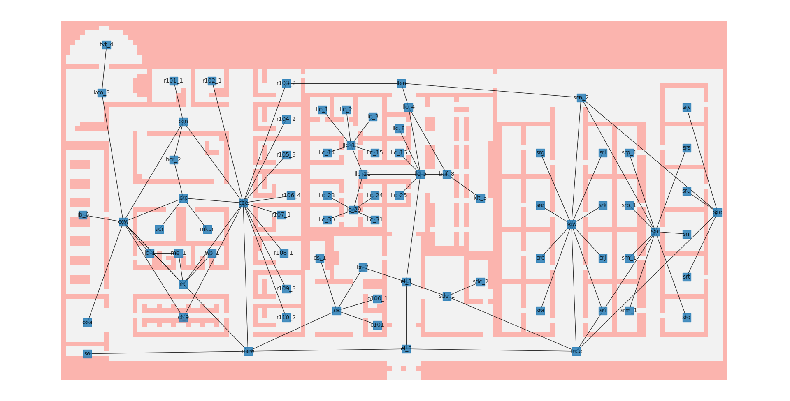

# Graph Environment for ASIST (Study 3)

Graph environment for ASIST, with intuition from the [MultiGrid Environment](https://github.com/ArnaudFickinger/gym-multigrid). The environment is compatible with [rllib's multi-agent environment](https://github.com/ray-project/ray/blob/master/rllib/env/multi_agent_env.py). There is also an API that mimics the [SMAC](https://github.com/oxwhirl/smac) environment.



## Installation

1. Install [Anaconda](https://www.anaconda.com/).
2. a) For **Windows**

Install [MSVC v142 (x86/64)](https://visualstudio.microsoft.com/visual-cpp-build-tools/) and [PyGraphviz](https://pygraphviz.github.io/).

```bash
git clone git@gitlab.com:cmu_asist/gym_graph.git
cd gym_graph
conda env create --name gym_graph -f environment_windows.yml
conda activate gym_graph
pip install -e .
cd ..
```

Verify installation by running:

```bash
cd gym_graph/demo
python demo_graph.py --render
```

2. b) For **Linux**

```bash
git clone git@gitlab.com:cmu_asist/gym_graph.git
cd gym_graph
conda env create --name gym_graph -f environment_linux.yml
conda activate gym_graph
pip install -e .
cd ..
```

Verify installation by running:

```bash
cd gym_graph/demo
python demo_graph.py
cd ..
cd ..
```

Note that rendering is only supported on Windows. This is because matplotlib uses platform-specific backends with incompatible APIs.

3. Patch rllib: 

```bash
cd gym_graph
python patch_rllib.py
cd ..
```

Details (based on Ray 1.12.1): some modules in `ray.rllib.models.torch.complex_input_net` are not properly registered in torch. Replace `<ray_path>/rllib/models/torch/complex_input_net.py` with the same-named file included under `patches_for_rllib/` in this repo, so that you can use a custom `ComplexInputNetwork` that deals with the nested Dict space provided calling `env.step(...)`.

## Design

The graphs in the `master` branch are not weighted. Check the `weighted` branch for a variant of this environment with weighted graphs.

Interactions with the environment can be done by either calling rllib's MARL API: `env.step(actions:dict[int:int]) -> obs_rllib:dict[int:dict], rewards:dict, done:dict, info:dict `, or by calling the SMAC-like API: `env.step_sc(actions:List[int]) -> reward:int, done: bool, info:dict `.

### Observation Space:

#### The rllib API:

`obs_rllib[agent_id]` is the **dictionary** with the following optional keys:

- `obs`: the agent-observation with a graph component and a self component:

  ```python
  {'graph': (self.num_nodes, Node.DIM + 1), # 2D over graph
   'agent': (InjuryIndex.one_hot_dim() + Role.one_hot_dim(),)} # 1D
  ```

  Unless `env.world.FULLY_OBSERVABLE` is true, content from nodes that the current agent do not occupy will be masked to 0.

- `state`: the global state from `env.get_state_unflattened()`, or `obs_rllib['state']` is a dictionary with element sizes: 

  ```python
  {'graph': (self.num_nodes, Node.DIM + self.num_agents), # 2D over graph
   'agent': (self.num_agents, InjuryIndex.one_hot_dim() + Role.one_hot_dim())} # 2D over agents
  ```

  which encodes: a) for each graph node, its content (the number of stabilized/unstabilized victims/evacuation zones of each injury type, the number of rubbles, and the whether a certain player is on this node); and b) for each agent, its role and the victim it is carrying. One hot encodings are used when applicable.

- `action_mask`: the multi-hot encoding `A(s)` that indicates which actions are currently available.

- `merged_obs`: (does not exist by default) the same shape as `obs`, but the `graph` sections are merged across agents.

- `agent_id`: (does not exist by default) the one-hot encoding of the agent's ID.

Alternatively, we can use a wrapper to **flatten the observations**, as shown in `demo/demo_wrapper.py`. By calling `env = FlattenObservation(env)`, we can access all attributes of the original environment. The only difference is the first element of the return of `reset/step` would be a `MultiAgentDict` of flattened Boxes, instead of a `MultiAgentDict` with nested dicts.

#### The SMAC API: 

These functions have no side effects:

- `env.get_obs_unflattened()` returns the **list** of `[obs_rllib[agent_id]['obs']` for all agent ids. `env.get_obs()` returns the flattened version. 

- `env_get_state_unflattened()` returns `obs_rllib[agent_id]['state']`. `env_get_state()` returns the flattened version.

- `env.get_avail_agent_actions(agent_id)` returns `obs_rllib[agent_id]['action_mask]`.

### Action Space:

The size of the action space is `N + len(utils.Actions)`, where `N` is the number of nodes. The first `N` dimensions means going to the corresponding node, where the last `len(utils.Actions)` actions would interact with the content of the current node. Only the adjacent nodes are reachable, and the availability of interactive actions are subject to the role and state of the current agent. Thus, please call `env.get_avail_agent_actions(agent_id)` to get a Boolean mask indicating the currently available actions. Meanwhile, in the rllib API, this information can be accessed in `obs_rllib['action_mask]`.

## Environment Instances

A few environments can be found in `graph_env/env/saturn.py`. These are currently under development and subject to change.

As of 7/1/2022, the segments in class names have the following meaning:

- `PO`: an agent can only see the content of the room node it currently reside in.
- `FO`: an agent sees the content of all room nodes.
- `Fixed`: node contents are fixed across initialization. Without this tag, the room contents (`Rubble, Victim, Evacuation`) are randomly shuffled across runs.
  - Note that the graph structure is always fixed, whereas the agents' initial locations are always randomized across runs.

- `Heterogeneous`: the behavior of agents are strictly heterogeneous, as only the transporter is allowed to pick-up/drop victims.
- `Homogeneous`: a simpler task where all three agents are transporters. There are no rubbles in the environment, and all victims are already stabilized.
- `Obs_Only/State_Only/Agent_ID/Mask`: configures which key to include in `obs_rllib`. Check which key exists by default in the rllib API section.
- `TopLeft/Left/Right/Middle/Full/HalfR`: the section of Saturn being used. Check `graph_env/env/resources` for saved visualizations.

## Acknowledgement

@sophieyueguo kindly provided the code and help for parsing connectivity in the Saturn Map.

@renos provided a patch for the termination condition of the environment.

## TODO and Known Issues

Please search all with `TODO`.
